# Cotsel Target-State System Architecture

This document is the canonical target-state architecture view for the completed
Agroasys + Cotsel platform model.

It is intentionally disciplined:
- one target-state diagram only
- one short current-vs-target note only
- no speculative container-by-container deployment sheet
- no treatment of `platform.v1` transitional Supabase ownership as canonical

The stack and infra expectations reflected here come from:
- `docs/architecture/job-and-eventing-strategy.md`
- `docs/runbooks/dashboard-local-parity.md`
- `docs/runbooks/dashboard-gateway-operations.md`
- the reviewed stack/infra source-of-truth docs (`technical stack.pdf`, `INFRA.pdf`)

## Target-State Diagram

```mermaid
---
config:
  flowchart:
    curve: linear
  layout: elk
  theme: default
  look: handDrawn
---
flowchart LR
    classDef user fill:#E0F7FA,stroke:#006064,stroke-width:2px,color:#000000,rx:5,ry:5
    classDef frontend fill:#E8F5E9,stroke:#2E7D32,stroke-width:2px,color:#000000,rx:5,ry:5
    classDef identity fill:#FFF3E0,stroke:#EF6C00,stroke-width:2px,color:#000000,rx:5,ry:5
    classDef app fill:#F3E5F5,stroke:#7B1FA2,stroke-width:2px,color:#000000,rx:5,ry:5
    classDef backend fill:#EDE7F6,stroke:#5E35B1,stroke-width:2px,color:#000000,rx:5,ry:5
    classDef blockchain fill:#E3F2FD,stroke:#1565C0,stroke-width:2px,color:#000000,rx:5,ry:5
    classDef treasury fill:#FFF9C4,stroke:#F57F17,stroke-width:2px,color:#000000,rx:5,ry:5
    classDef storage fill:#CFD8DC,stroke:#455A64,stroke-width:2px,color:#000000,rx:5,ry:5
    classDef external fill:#FFEBEE,stroke:#C62828,stroke-width:2px,color:#000000,rx:5,ry:5

    subgraph L1["Actors & Access Edge"]
      direction TB
      subgraph Actors["Actors & External Boundaries"]
        direction TB
        buyers["Enterprise Buyers"]
        suppliers["Suppliers / Cooperatives"]
        admins["Agroasys Admin / Operators"]
        auditors["External Auditors"]
        regulators["Regulators / Govt Agencies"]
        logistics_ext["Logistics / Inspection Providers"]
        fiat_partners["Fiat On-Ramp / Off-Ramp Partners"]
        banks["Banking / Treasury Payout Rails"]
        kyb_provider["KYB / KYC Provider"]
        kyt_provider["AML / KYT Provider"]
        sanctions["Sanctions Data<br/>OFAC / UN / local lists"]
      end

      subgraph Edge["Global Edge & Delivery"]
        direction TB
        cf_edge["Cloudflare Edge<br/>DNS + CDN + WAF + DDoS + rate controls"]
        frontend_hosting["Frontend Hosting<br/>Cloudflare Pages / edge-hosted apps"]
        alb["AWS ALB / private API ingress"]
      end
    end
    class buyers,suppliers,admins user
    class auditors,regulators,logistics_ext,fiat_partners,banks,kyb_provider,kyt_provider,sanctions external
    class cf_edge,frontend_hosting,alb frontend

    subgraph L2["Client & Identity Layer"]
      direction TB
      subgraph Presentation["Presentation Layer"]
        direction TB
        buyer_app["Agroasys Buyer App<br/>trade creation / checkout"]
        supplier_app["Agroasys Supplier App<br/>status / evidence / confirmations"]
        ops_dash["Cotsel-Dash<br/>operator dashboard"]
        sdk["Agroasys SDK<br/>typed platform + settlement client"]
        web3auth["Web3Auth<br/>embedded wallet / signer"]
        doc_uploader["Secure Document Uploader"]
      end

      subgraph Identity["Identity & Access"]
        direction TB
        auth_service["Agroasys Auth Service<br/>SSO / sessions / refresh / revoke / RBAC"]
        shared_auth["shared-auth<br/>service-to-service HMAC auth"]
        auth_db[("Identity Postgres<br/>profiles + sessions")]
      end
    end
    class buyer_app,supplier_app,ops_dash,sdk,web3auth,doc_uploader frontend
    class auth_service,shared_auth identity
    class auth_db storage

    subgraph L3["Agroasys Platform Layer"]
      direction TB
      subgraph Platform["Agroasys Platform Backend"]
        direction TB
        api_runtime["Platform API Runtime<br/>NestJS modular monolith"]
        worker_runtime["Worker Runtime<br/>queue + outbox processors"]

        subgraph PlatformDomains["Core Domain Modules"]
          direction TB
          access_admin["Dashboard / Admin / Audit / Reporting"]
          commerce["Products / Listings / Offers / Orders / Demand"]
          ops_docs["Documents / Invoice / Logistics / Tracking"]
          compliance["Compliance Orchestration"]
          finance["Payments / Wallet / Ledger / Subscription"]
          settlement_handoff["Settlement Handoff<br/>Ricardian signatures, dispatch,<br/>callbacks, disputes, reconciliation status"]
          notifications_mod["Notification Orchestration"]
        end
      end

      subgraph PlatformData["Platform Data & Eventing"]
        direction TB
        ops_db[("Platform Aurora / Postgres")]
        redis_cache["Redis / BullMQ<br/>non-critical only"]
        sqs["SQS + DLQs<br/>durable async jobs"]
        eventbridge["EventBridge<br/>internal domain events"]
        s3_store[("S3 Object Storage<br/>documents + evidence bundles")]
        kms["Secrets Manager + KMS"]
      end
    end
    class api_runtime,worker_runtime,access_admin,commerce,ops_docs,compliance,finance,settlement_handoff,notifications_mod app
    class redis_cache,sqs,eventbridge backend
    class ops_db,s3_store,kms storage

    subgraph L4["Cotsel Settlement Layer"]
      direction TB
      subgraph Cotsel["Cotsel Settlement & Control Subsystem"]
        direction TB
        dashboard_gateway["Dashboard Gateway<br/>reads, bundles, governance,<br/>compliance ledgers, audit"]
        cotsel_auth["Cotsel Auth Boundary"]

        subgraph CotselServices["Settlement Services"]
          direction TB
          ricardian_svc["Ricardian Service<br/>canonicalize + hash + retrieval"]
          oracle_svc["Oracle Service<br/>milestone / evidence triggers<br/>for contract confirmation"]
          indexer_graphql["Indexer + GraphQL<br/>trade timeline + read models"]
          reconciler["Reconciliation Worker<br/>scheduled checks + drift / anomaly triggers"]
          treasury_svc["Treasury Service<br/>release / export only after<br/>milestone + compliance + clean state"]
          cotsel_notifications["Cotsel Notifications"]
          gov_executor["Governance Executor<br/>manual override / dispute / stuck-state remediation"]
        end

        gateway_db[("Cotsel Gateway Postgres")]
        cotsel_db[("Cotsel Service Postgres")]
      end
    end
    class dashboard_gateway,cotsel_auth,ricardian_svc,oracle_svc,indexer_graphql,reconciler,cotsel_notifications,gov_executor backend
    class treasury_svc treasury
    class gateway_db,cotsel_db storage

    subgraph L5["Settlement Chain"]
      direction TB
      subgraph Chain["Settlement Layer"]
        direction TB
        rpc_providers["Polkadot Asset Hub RPC<br/>primary + fallback"]
        escrow_contract["Escrow Smart Contract<br/>settlement + governance + claims"]
        assets_pallet["USDC Asset Rail"]
        asset_conversion["Asset Conversion<br/>fee abstraction"]
      end
    end
    class rpc_providers,escrow_contract,assets_pallet,asset_conversion blockchain

    buyers --> cf_edge
    suppliers --> cf_edge
    admins --> cf_edge
    auditors --> cf_edge

    cf_edge --> frontend_hosting
    cf_edge --> alb
    frontend_hosting --> buyer_app
    frontend_hosting --> supplier_app
    frontend_hosting --> ops_dash
    alb --> api_runtime

    buyer_app --> sdk
    supplier_app --> sdk
    sdk --> web3auth
    web3auth --> escrow_contract
    buyer_app --> doc_uploader
    supplier_app --> doc_uploader
    doc_uploader --> ops_docs
    buyer_app --> api_runtime
    supplier_app --> api_runtime
    ops_dash --> api_runtime
    ops_dash --> dashboard_gateway

    api_runtime --> auth_service
    auth_service --> auth_db
    auth_service --> kms
    cotsel_auth --> auth_db
    shared_auth -.-> dashboard_gateway
    shared_auth -.-> ricardian_svc
    shared_auth -.-> oracle_svc
    shared_auth -.-> treasury_svc

    api_runtime --> access_admin
    api_runtime --> commerce
    api_runtime --> ops_docs
    api_runtime --> compliance
    api_runtime --> finance
    api_runtime --> settlement_handoff
    api_runtime --> notifications_mod

    api_runtime --> ops_db
    api_runtime --> redis_cache
    api_runtime --> eventbridge
    api_runtime --> sqs
    sqs --> worker_runtime
    worker_runtime --> settlement_handoff
    worker_runtime --> notifications_mod

    access_admin --> ops_db
    regulators -.-> access_admin
    auditors -.-> s3_store
    commerce --> ops_db
    ops_docs --> ops_db
    ops_docs --> s3_store
    ops_docs --> logistics_ext
    compliance --> ops_db
    compliance --> kyb_provider
    compliance --> kyt_provider
    compliance --> sanctions
    finance --> ops_db
    finance --> fiat_partners
    finance --> banks
    settlement_handoff --> ops_db
    settlement_handoff --> s3_store
    settlement_handoff --> eventbridge
    settlement_handoff --> sqs
    settlement_handoff --> dashboard_gateway
    settlement_handoff --> cotsel_auth
    notifications_mod --> eventbridge
    notifications_mod --> sqs

    dashboard_gateway --> gateway_db
    dashboard_gateway --> cotsel_auth
    dashboard_gateway --> indexer_graphql
    dashboard_gateway --> ricardian_svc
    dashboard_gateway --> treasury_svc
    dashboard_gateway --> reconciler
    dashboard_gateway --> gov_executor

    ricardian_svc --> s3_store
    ricardian_svc --> cotsel_db
    oracle_svc --> cotsel_db
    logistics_ext -.-> oracle_svc
    oracle_svc --> escrow_contract
    indexer_graphql --> cotsel_db
    indexer_graphql -.-> rpc_providers
    indexer_graphql --> reconciler
    indexer_graphql --> treasury_svc
    escrow_contract --> assets_pallet
    asset_conversion -.-> assets_pallet
    escrow_contract -.-> indexer_graphql
    reconciler --> cotsel_db
    reconciler -.-> rpc_providers
    reconciler --> cotsel_notifications
    treasury_svc --> cotsel_db
    treasury_svc -.-> banks
    treasury_svc --> cotsel_notifications
    cotsel_notifications --> sqs
    cotsel_notifications --> eventbridge
    gov_executor -.-> rpc_providers

    linkStyle default stroke:#9aa0a6,stroke-width:1.6px

    linkStyle 0,1,2,3,4,5,6,7,8,9 stroke:#1f77b4,stroke-width:2.6px
    linkStyle 10,11,12,13,14,15,16,17,18,19,20 stroke:#17becf,stroke-width:2.6px
    linkStyle 21,22,23,24,25,26,27,28,44,50,51,52,53,62 stroke:#ff7f0e,stroke-width:2.6px
    linkStyle 29,30,31,32,33,34,35,36,37,38,39,40,41,42,43,45,46,47,48,54,57,58,59,60,63,64 stroke:#2ca02c,stroke-width:2.6px
    linkStyle 49,55,56,75,88 stroke:#8c564b,stroke-width:2.6px
    linkStyle 65,66,67,68,69,70,71,72,73,74,77,79,80,84,86,87,89,90,91 stroke:#9467bd,stroke-width:2.6px
    linkStyle 61,76,78,81,82,83,85,92 stroke:#1565C0,stroke-width:2.8px
```

## Current vs Target

- Current repo truth already contains the major Cotsel settlement/control
  services represented above: auth, gateway, ricardian, oracle, indexer,
  reconciliation, treasury, notifications, SDK, and shared-auth.
- Transitional `platform.v1` Supabase ownership is not canonical target-state
  architecture and is intentionally excluded from this diagram.
- This diagram is a target-state system architecture view. It is not intended
  to serve as a speculative per-container deployment sheet.

## Related Documents

- [`../../README.md`](../../README.md)
- [`../runbooks/dashboard-local-parity.md`](../runbooks/dashboard-local-parity.md)
- [`../runbooks/dashboard-gateway-operations.md`](../runbooks/dashboard-gateway-operations.md)
- [`./job-and-eventing-strategy.md`](./job-and-eventing-strategy.md)
