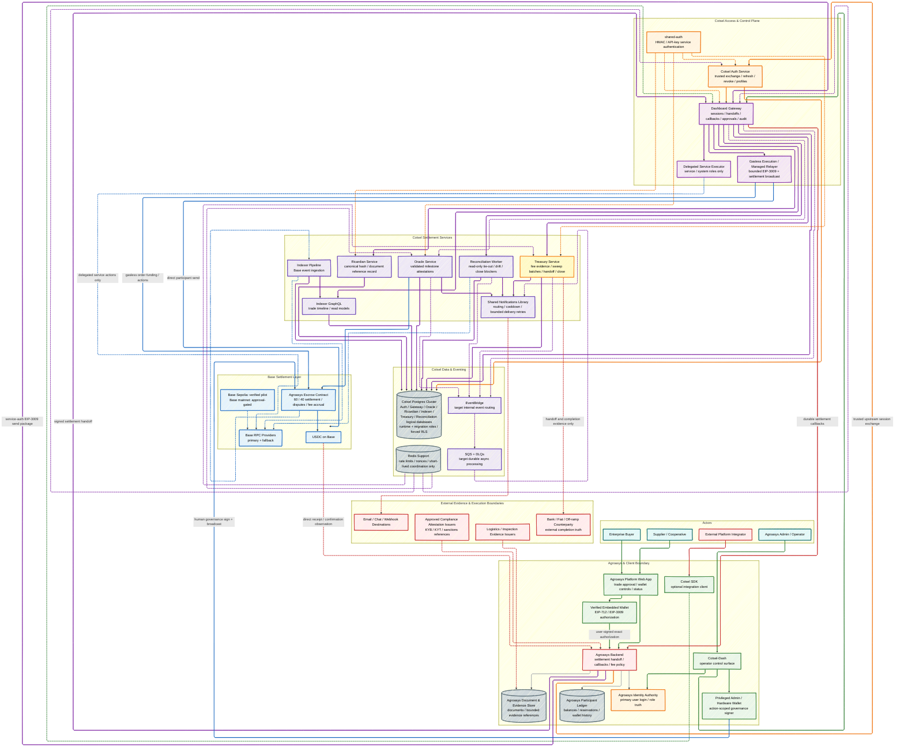

# Cotsel System Architecture

This is the canonical architecture view for the active Cotsel settlement and
control subsystem. It treats Agroasys as an upstream integration boundary rather
than duplicating the entire marketplace architecture inside Cotsel.

The diagram distinguishes implemented runtime from target or external
infrastructure. Dashed SQS and EventBridge connections are target durable
eventing; current gateway, relayer, callback, governance, treasury, and
reconciliation workflows persist operational evidence in Postgres where
implemented.

## Architecture Diagram

## Boundary Rules

- Agroasys owns primary identity, fee policy, participant balances, direct
  receipt discovery, send intents, reservations, wallet history, and participant
  reconciliation.
- Cotsel order escrow begins only after explicit buyer payment approval, a valid
  settlement package, successful contract lock, and reconciliation of that chain
  state back to Agroasys.
- Direct participant USDC transfers are separate from order settlement. Cotsel
  only validates and broadcasts the exact user-signed EIP-3009 authorization; it
  does not choose the participant, recipient, or amount and does not own the
  participant ledger.
- Human privileged governance uses gateway prepare, direct admin-wallet signing
  and broadcast, then gateway confirm and monitoring. The executor remains only
  for delegated service or system roles.
- Contract truth owns settlement execution and treasury fee accrual. Treasury
  owns sweep, handoff, realization, and close evidence. Gateway owns approval and
  signing truth. Reconciliation owns tie-out and exception truth. External
  regulated counterparties own fiat completion truth.
- Cotsel consumes bounded compliance and logistics attestation references. The
  repository does not contain direct KYB, KYT, sanctions, banking, or logistics
  provider execution clients.
- Redis is support infrastructure only. SQS with DLQs and EventBridge are the
  durable target; they are not represented as already replacing current
  Postgres-backed operational records.
- EIP-7702 account abstraction is parked. Active settlement and sponsored-send
  paths use EIP-712 and EIP-3009.
- Base Sepolia has verified pilot evidence. Base mainnet remains gated by the
  documented go/no-go and rollback approvals.

## Canonical Integration Sequences

### Order settlement

1. Agroasys verifies both Ricardian signatures, the accepted logistics quote,
   buyer-confirmed logistics fee, exact payment package, verified wallet link,
   policy readiness, and available participant balance.
2. The buyer selects **Pay now** and signs the backend-issued buyer and
   EIP-3009 USDC authorizations.
3. Agroasys persists the settlement intent and reservation, then submits the
   service-authenticated package to the Cotsel Gateway.
4. The managed relayer broadcasts the gasless create-trade transaction.
5. Escrow starts only when the contract lock succeeds and Agroasys reconciles
   the confirmed `TradeLocked` event. Submission or browser acknowledgement is
   not settlement truth.

### Direct participant USDC movement

- Incoming USDC is discovered and reconciled by Agroasys; Cotsel is not in the
  receipt path.
- For an outgoing direct send, Agroasys owns the intent, reservation, history,
  ledger posting, and chain reconciliation. Cotsel validates and broadcasts
  only the exact service-authenticated EIP-3009 authorization.
- Direct transfers cannot create escrow, satisfy milestones, spend escrowed
  value, or call order-release functions.

### Release and inspection

1. The verified custody/document milestone reaches Cotsel through the signed
   Agroasys handoff and Oracle boundary.
2. Stage 1 transfers the net supplier first tranche based on the 60% gross
   tranche and accrues treasury-entitled fees separately.
3. Arrival and receipt make the goods available for the order's immutable
   inspection policy; receipt alone does not accept quality.
4. Explicit inspection acceptance or expiry of the notice window without an
   open dispute authorizes the final 40% supplier release.
5. A timely dispute holds the final 40% until the governed resolution refunds
   the buyer or releases the supplier principal.
6. Indexing, signed callbacks, and reconciliation return execution truth to
   Agroasys before participant-facing order and ledger state is finalized.

### Human governance

Human privileged governance follows gateway `prepare`, admin review, direct
admin-wallet sign and broadcast, then gateway `confirm`, monitoring, and
reconciliation. The delegated executor is not a fallback for human governance;
it remains limited to intentional service or system roles.

## Runtime Components

The active runtime profile contains `auth`, `gateway`, `oracle`, `ricardian`,
`treasury`, `reconciliation`, `indexer-pipeline`, `indexer-graphql`, Postgres,
and Redis. `notifications` is a shared package embedded into service runtimes;
notification wiring is health-checked but it is not a standalone Compose
container.

## Sources of Truth

- [`../../README.md`](../../README.md)
- [`../runbooks/runtime-truth-deployment-guide.md`](../runbooks/runtime-truth-deployment-guide.md)
- [`../runbooks/runtime-stack.md`](../runbooks/runtime-stack.md)
- [`../runbooks/compliance-boundary-kyb-kyt-sanctions.md`](../runbooks/compliance-boundary-kyb-kyt-sanctions.md)
- [`../adr/adr-0411-human-governance-direct-wallet-signing.md`](../adr/adr-0411-human-governance-direct-wallet-signing.md)
- [`../adr/adr-0412-treasury-revenue-controls-boundary.md`](../adr/adr-0412-treasury-revenue-controls-boundary.md)
- [`../adr/adr-0413-agroasys-wallet-rails-and-escrow-start-boundary.md`](../adr/adr-0413-agroasys-wallet-rails-and-escrow-start-boundary.md)
- [`./job-and-eventing-strategy.md`](./job-and-eventing-strategy.md)
- [`./eip-7702-account-abstraction-deferral.md`](./eip-7702-account-abstraction-deferral.md)
